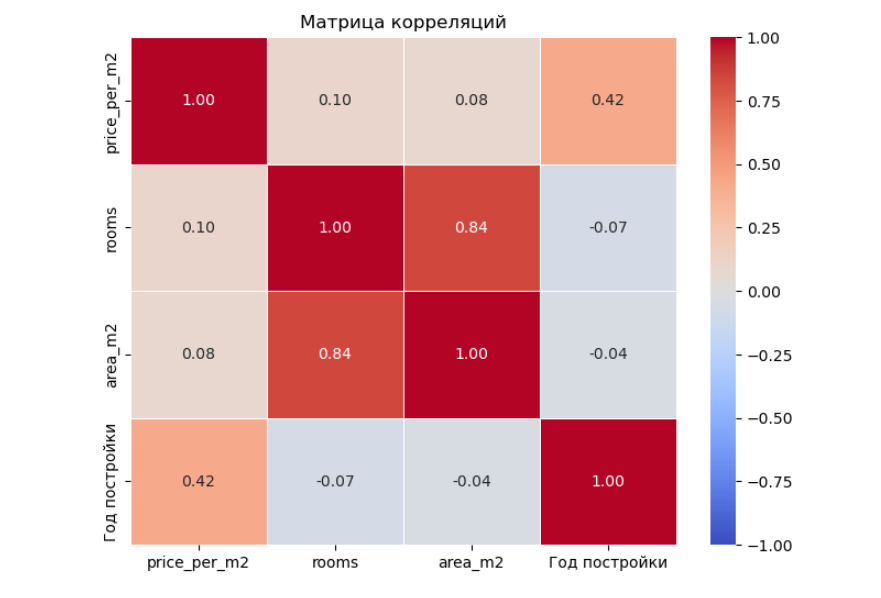
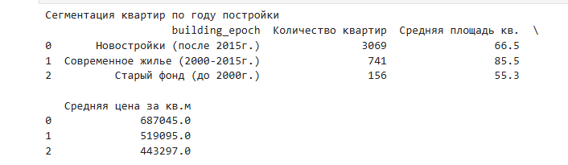

# Astana Real Estate Market — EDA Project
Exploratory data analysis of Astana housing market using Python, SQL, and statistical testing.

# 🏢 Анализ рынка недвижимости Астаны (EDA + SQL + Статистика)

Проект посвящен разведочному анализу данных (EDA) рынка жилья, очистке данных от аномалий, проверке статистических гипотез и формированию аналитических витрин.

## 🛠️ Стек технологий
* **Python** (Pandas, NumPy) — обработка и очистка данных.
* **Seaborn & Matplotlib** — визуализация распределений и корреляционных матриц.
* **SciPy** (stats) — проверка статистических гипотез (ANOVA).
* **SQL (SQLite)** — построение аналитических витрин с использованием оконных функций и условной агрегации.

## 📈 Ключевые этапы и результаты

1. **Очистка данных (Data Cleaning):** С помощью межквартильного размах (IQR) были выявлены и отсечены экстремальные выбросы и ценовые аномалии. В процессе анализа обнаружены дубликаты объявлений, что подсветило необходимость внедрения этапа дедупликации.
2. **Анализ корреляций:** Настроена корректная визуализация матрицы Пирсона (`vmin=-1, vmax=1`). Выявлена умеренная прямая связь между стоимостью квадратного метра и годом постройки дома.

3. **Проверка гипотез (ANOVA):** * Доказана статистическая значимость влияния количества комнат на цену за кв.м.
   * Проведен самостоятельный дисперсионный анализ влияния района на стоимость жилья. Полученный `p-value` (уровень 9.53e-101) математически подтвердил, что локация является фундаментальным драйвером цены.
4. **SQL-аналитика:** * Реализована витрина ТОП-3 самых дорогих лотов для каждого района с использованием оконной функции `ROW_NUMBER() OVER(PARTITION BY...)`.
   * Выполнена сегментация рынка по эпохам застройки через `CASE WHEN`. Выявлен тренд на оптимизацию площадей в современных новостройках (66.5 кв.м) по сравнению с домами 2000-2015 гг. (85.5 кв.м).

**Данные:** ~3200 объявлений о продаже квартир в Астане  
Источник: [Kaggle — Astana Real Estate Dataset](https://www.kaggle.com/datasets/turarr/astana-real-estate-dataset)
