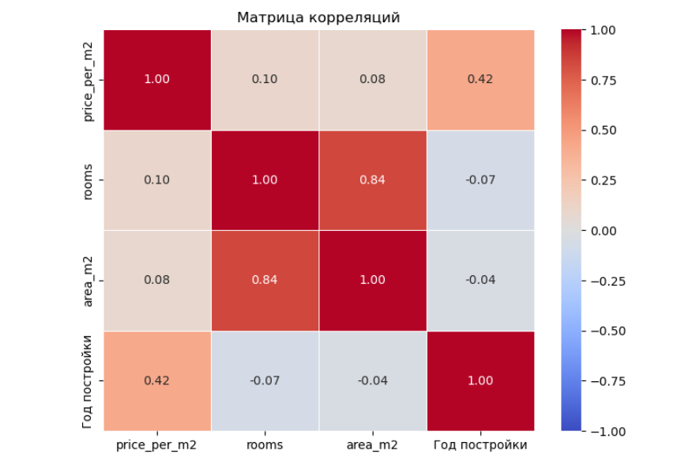
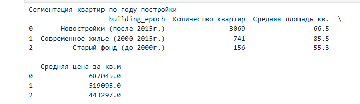

# 🏢 Astana Real Estate Market Analysis: Pricing Dynamics & Segmentation

This repository contains an exploratory data analysis (EDA) of the Astana real estate market. The goal of this project was to apply a full analytical stack: Python (Pandas), Inferential Statistics, and SQL to raw regional data to investigate the true impact of district geography and construction year on property valuations.

**🛠️ Tech Stack & Tools:**
* **Python (Pandas, NumPy):** Data cleaning and outlier detection.
* **Data Visualization (Seaborn, Matplotlib):** Distribution plotting and correlation heatmaps.
* **SciPy:** Statistical hypothesis testing (ANOVA).
* **SQL (SQLite):** Advanced data segmentation and ranking via window functions.

**📈 Key Business Insights:**

1. **A City of New Developments:** The market is heavily skewed towards new builds. Only 156 properties in the dataset were built before 2000, whereas over 3,000 listings date from 2015 onwards.

2. **The Age Premium:** Correlation heatmaps revealed a direct relationship between build year and price. SQL segmentation confirmed this: a square meter in a new development averages 687,000 KZT, making it 1.5x more expensive than the older housing stock.

3. **Geographical Significance:** To prove that district-level price differences weren't just statistical noise, I conducted an ANOVA test. The resulting P-value of $9.53 \cdot 10^{-101}$ mathematically confirms a strict statistical significance in district pricing dynamics.

4. **Shrinking Living Spaces:** Properties built between 2000 and 2015 offer significantly more space, averaging 85 sq.m. Modern new builds are noticeably smaller, averaging 66 sq.m.

**🧠 Engineering Challenges & Solutions:**
* **Data Visualization Integrity:** Initially, the Seaborn correlation heatmap displayed a 0.42 coefficient in a deceptively pale shade, undermining the visual strength of the relationship. I recalibrated the color matrix by strictly defining boundaries (`vmin=-1, vmax=1`) to ensure accurate data representation.
* **SQL Execution Logic:** While segmenting data by construction year, utilizing a column alias within a `GROUP BY` clause resulted in execution errors. I refactored the query by duplicating the `CASE WHEN` logic directly into the grouping function to ensure stability.
* **Data Janitoring:** During the Interquartile Range (IQR) calculation, I identified hidden duplicate listings. This highlighted the necessity of implementing a strict deduplication pipeline as a primary step in future projects.

**Dataset:** ~3,200 real estate listings in Astana  
**Source:** [Kaggle — Astana Real Estate Dataset](https://www.kaggle.com/datasets/turarr/astana-real-estate-dataset)

---

## 🇷🇺 Russian Version (Описание на русском)

# 🏢 Анализ рынка недвижимости Астаны

Это мой первый самостоятельный пет-проект. Я взял сырые данные по квартирам в Астане, чтобы на реальной задаче отработать связку Python (Pandas) + статистика + SQL. Мне было интересно проверить, реально ли район и год постройки влияют на цену так сильно, как все говорят.

**🛠️ Что я использовал:**
* **Python (Pandas, NumPy)** — для чистки данных от мусора и выбросов.
* **Seaborn & Matplotlib** — для графиков и тепловой карты корреляций.
* **SciPy** — для математической проверки гипотез (ANOVA).
* **SQL (SQLite)** — для финальной сегментации и поиска топов (оконные функции).

**📈 Главные инсайты (что я нашел в данных):**

1. **Астана — город новостроек.** Из всей базы только 156 квартир построены до 2000 года. Остальное (более 3000 лотов) — это свежие дома после 2015 года.

2. **Год решает.** Тепловая карта показала прямую зависимость цены от года постройки. SQL-запрос это подтвердил: квадрат в новостройке (687 тыс. ₸) в полтора раза дороже старого фонда.

3. **Район — это не просто название.** Я написал тест ANOVA, и он выдал P-value уровня $9.53 \cdot 10^{-101}$. Это математически доказывает, что цены в районах реально разные, и это не статистическая случайность.

4. **Площади уменьшаются.** Квартиры, построенные в 2000-2015 годах, в среднем на 20 квадратов больше (85 кв.м), чем современные новостройки (66 кв.м).

**🧠 С какими трудностями я столкнулся:**
* **Оптические иллюзии на графиках:** Сначала тепловая карта Seaborn раскрасила коэффициент 0.42 как почти белый, из-за чего связь казалась слабой. Пришлось лезть в документацию и жестко задавать границы `vmin=-1, vmax=1`, чтобы цвета стали честными.
* **Ошибки в SQL:** При написании сегментации по годам постройки я пытался использовать алиас колонки внутри `GROUP BY`, что ломало запрос. Пришлось дублировать логику `CASE WHEN` в группировку.
* **Грязные данные:** При расчете межквартильного размаха (IQR) я заметил, что в базе есть явные дубликаты лотов. В будущем для таких проектов нужно добавлять этап строгой дедупликации перед анализом.

**Данные:** ~3200 объявлений о продаже квартир в Астане  
Источник: [Kaggle — Astana Real Estate Dataset](https://www.kaggle.com/datasets/turarr/astana-real-estate-dataset)
